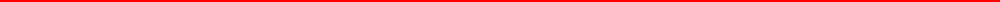

# Hello Folks 👋

Hi, I'm Giuseppe a Full Stack Web Developer from Italia.
Always passionate about technology and curious about its logic, lover of Movies and SeriesTV and great gamer. A real Nerd. 🤓

## Reach me 📮

### Technologies

### CMS

*...but it is not the end*
